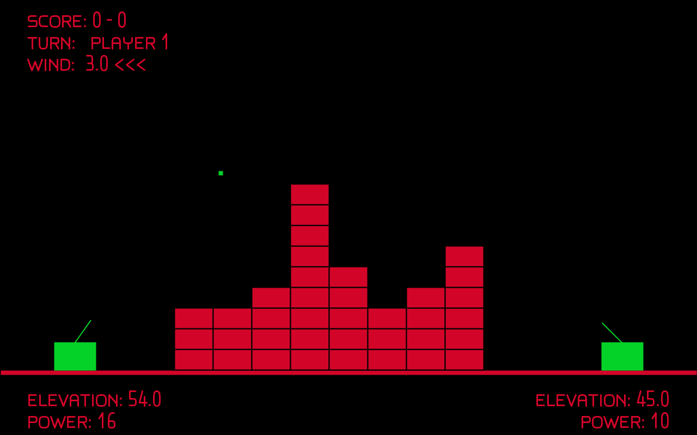

# Artillery Game

Artillery is a two-player game built in Processing for the Video Games module at the University of St&nbsp;Andrews.

## Controls

### Menu State

Select an option by pressing the number key associated with it. Following that, set a value with the key associated with it.

### Game State

These controls are also listed on the menu screen.

- Move left: `A`
- Move Right: `D`
- Increase gun elevation: `W`
- Decrease gun elevation: `S`
- Increase gun power: `+`
- Decrease gun power: `-`
- Fire gun: `Enter`

### Results State

Press the `Enter` key to return to the menu.

## License

Copyright 2017 Billy Brown.

This project (Artillery) is licensed under the Mozilla Public License version 2.0. See LICENSE file.
